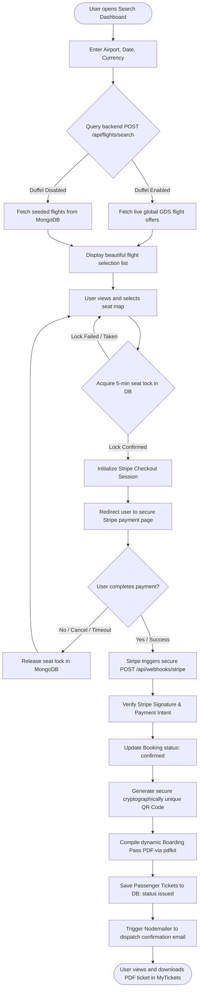
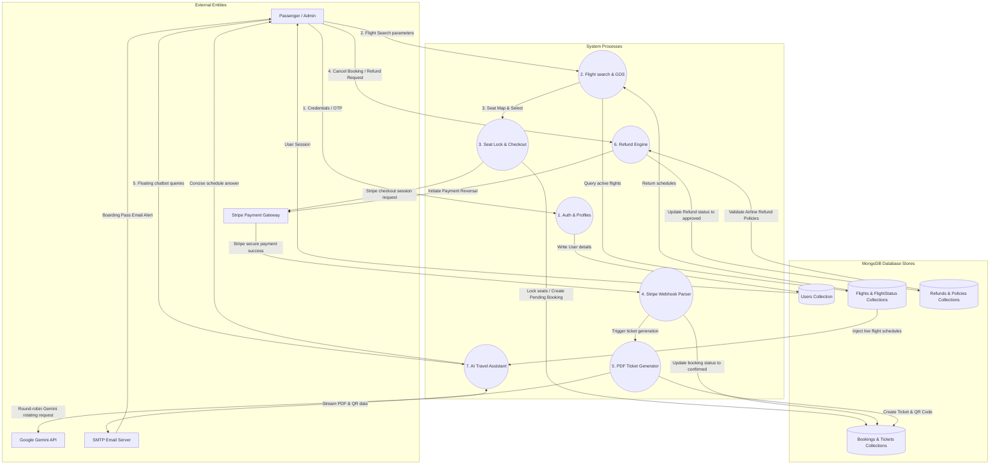
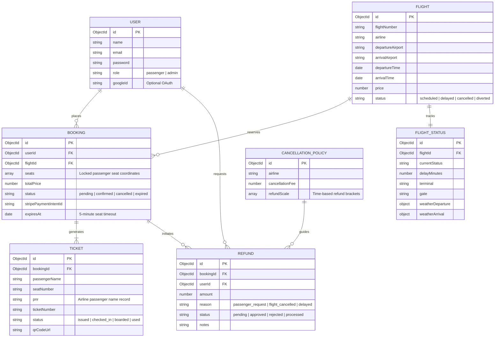

# 📊 FlightAgent: Control Flow, Data Flow, and Entity-Relationship Diagrams

This document contains high-fidelity visual diagrams explaining the execution logic, data lifecycle, and database schemas of the **FlightAgent** system.

---

## 🔁 1. Control Flow Diagram (CFD)

The Control Flow Diagram traces the step-by-step logic path when a passenger searches for a flight, locks a seat, triggers Stripe checkout, and receives a cryptographic ticket.

---

## 🔀 2. Data Flow Diagram (DFD - Level 1)

This DFD outlines the inputs, outputs, processes, and database stores of the system, tracking how user credentials, checkout events, flight updates, and Gemini inputs are processed.

---

## 🗄️ 3. Entity Relationship Diagram (ERD)

This physical database model outlines the relational design of your MongoDB Mongoose collections, detailing keys, reference fields, and logical cardinality.

---

## 💡 How to Read these Diagrams in Your Code Editor

1. **Mermaid Previewers**: Many modern markdown viewers (such as VS Code Markdown Preview, GitHub, GitLab, or Obsidian) render these diagrams interactively.
2. **Interactive Flow**:
   * Refer to `backend/controllers/webhookController.js` and `backend/services/ticketService.js` to see the logic mapped in the **Control Flow Diagram**.
   * Refer to `backend/models/` to inspect the exact schema definitions sketched in the **Entity Relationship Diagram**.
